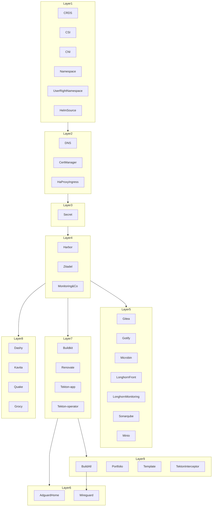

## What's new

Well... i kinda change everything... again.

## LAYERING OVER HEAVEN

In a attempt to fix some of the problem i had with my previous setup, i decided to change everything. I'm still using the same tools, but i'm using them differently.

### GitOps

The choice has been made to keep it but to change the deployment order/dependency and process. A layering process has been put in place. The idea is to have a layering of the deployment. Each layer is a set of application that are deployed together. The layer are deployed in order of requirement. The layer are:

### CNI

What is a CNI ? Well it's a Container Network Interface and it's used to create network for container. I'm using [Cilium](https://cilium.io/) as my CNI. It's a really good CNI and it's working really well. I'm using it in BGP mode, so i can have a really good network and i can use it to connect my cluster to my home network if needed. The setup is actually really easy but not complete at the moment. What i'm missing:

- [ ] Setup the Service Mesh
- [ ] Setup the Monitoring
- [ ] Setup the [Gateway Api](https://docs.cilium.io/en/stable/network/servicemesh/gateway-api/gateway-api/#what-is-gateway-api) - [Doc](https://gateway-api.sigs.k8s.io/)

### CSI

What is a CSI ? Well it's a Container Storage Interface and it's used to create storage for container. I'm using [Longhorn](https://longhorn.io/) as my CSI. It's a really good CSI and it's working really well. I'm also using it to backup my data.

### Gateway Api

During my search for more observability and security, i found the [Gateway Api](https://gateway-api.sigs.k8s.io/) relatable has a Ingress Killer. Why does the Ingress should be replaced by the GateWay Api? The Gateway Api is more compatible with the CNI and Service Mesh. It's also more secure and flexible by being more configurable. If you want to know more click on the link above.

## Upgrade

In order to facilitate my upgrade process, i setup [Renovate](https://www.mend.io/renovate/) to handle the upgrade of my dependencies. It's really easy to use and it's working really well. I just need to execute the renovate job daily and it create PR when needed and merge it when i think it's ok.

Well we need everything to be up to date, so i upgraded everything to the latest version available like

- No Upgrade this time

While working on the upgrade part, i ended up thinking that setting up Changelog would be a good thing. So i'm thinking of including [cog](https://docs.cocogitto.io/).

## Next to do

- [ ] Setup the Service Mesh [#71](https://github.com/batleforc/WeeboGitOps/issues/71)
- [ ] Setup the Monitoring/Overservability of Cilium [#71](https://github.com/batleforc/WeeboGitOps/issues/71)
- [ ] Migrate to the Gateway Api [#70](https://github.com/batleforc/WeeboGitOps/issues/70)
- [ ] Slowly secure the Harbor Cache [#55](https://github.com/batleforc/WeeboGitOps/issues/55)
- [ ] Include KEDA and the PodAutoScaller [#17](https://github.com/batleforc/WeeboGitOps/issues/17)
- [ ] Préparer l'ajout de nouveaux uttilisateurs [#72](https://github.com/batleforc/WeeboGitOps/issues/72)
- [ ] Travailler sur un un équivalent a Tibco BW en passant possiblement par [Knative](https://knative.dev/) [#69](https://github.com/batleforc/WeeboGitOps/issues/69)

While i was upgrading everything it become obvious that i need to upgrade my use of Github. Then i moved from the old Github Dashboard to [the new one](https://github.com/users/batleforc/projects/7/views/1). Event if i wasn't writing the doc, i was still working on the project and updating the dashboard and issues.
