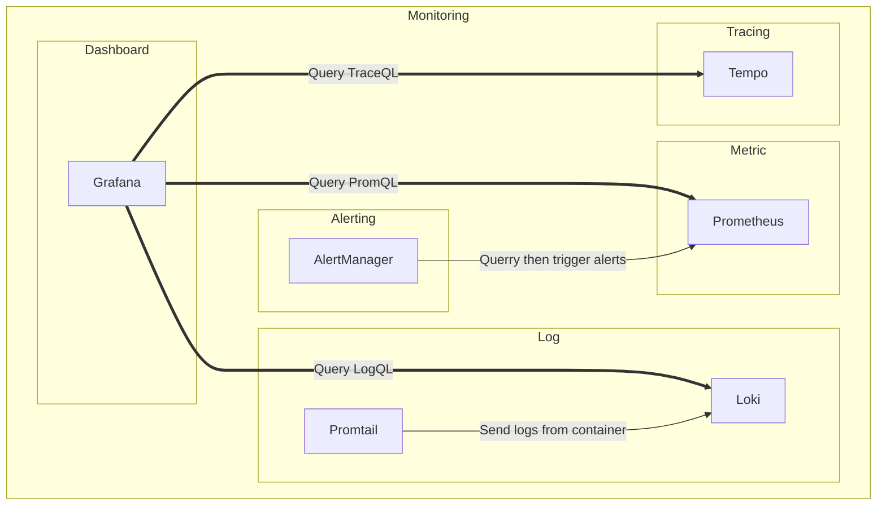

# Monitoring

Having a cluster is great, but it's not enough. We need to monitor it. For that, we use what's called an extended PromStack.

Monitoring is a very important part of a cluster. It allows us to know the current state of our cluster and to be alerted when something goes wrong. And if things go wrong, we can use the logs and traces to find the root cause of the problem.

## Grafana

Grafana is a dashboarding tool that can display data from multiple "datasources". In our case, we use Prometheus to collect, querry and store metrics, Loki for logs and Tempo for traces.

If you are collecting the right data, you can create some nice dashboard like this one that allow me to know the current state of my cluster:

## Prometheus

Prometheus is a monitoring tool that collect metrics from multiple sources. It can also querry the data it collected and store it. It's the main datasource of Grafana.

With the help of grafana and PromQL, we can for exemple querry every metrics collected in the "monitoring" namespace and display them in a graph:

Here without formating, it doesn't make sense because there is too much different data.

## Loki

Loki is a service that allow to store and explore logs. It's the main datasource of Grafana for logs.

With the help of grafana and LogQL, we can for exemple querry every logs collected in the "monitoring" namespace and display them in a table:

Here without formating, it doesn't make sense because there is too much different log.

## Tempo

Tempo is a service that allow to store and explore traces. It's the main datasource of Grafana for traces. Tempo is able to store traces from multiple sources like Jaeger or OpenTelemetry.

With the help of grafana and TraceQL, we can for exemple querry every traces collected:

At the moment not much traces are collected, but it's a good start.

## AlertManager

AlertManager is a service that allow to trigger alerts based on querry. It's the main datasource of Grafana for alerts. It's included in the Grafana ui.

Once it has been configured, it can send alerts to multiple channels like email, slack, discord, etc.

With the the help of grafana and the different querry language, we can follow the state of our alerts:

