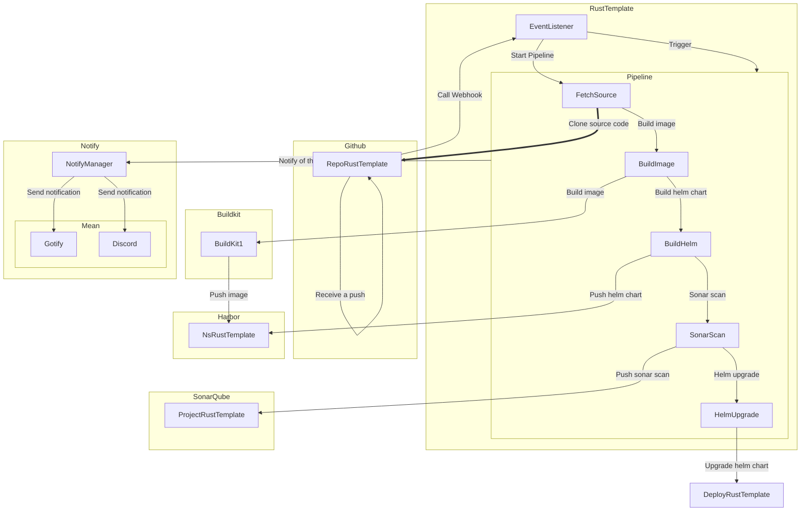

# Tekton Env

## WorkFlow

The CI/CD used in this environment is based on Tekton. If you need a deep dive into Tekton, you can read the [official documentation](https://tekton.dev/docs/).

Here i will only explain how i work with Tekton.

