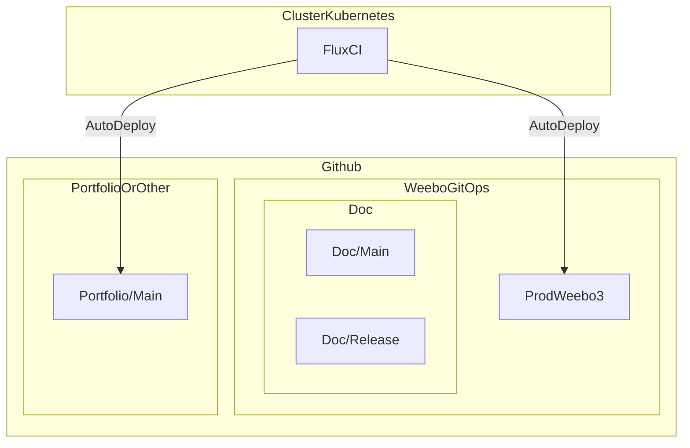

# Getting started

## Why?

First. Because Why Not ?

And learning the basics of GitOps seems to be a good idea with enouth background and diffenrents thing that can be learned.

In addition to that handling my own cluster with GitOps can make my life easier.

## How?

So, in our case we need to deploy some application like the basical need of a young DevOps like me:

- CI/CD engine (Tekton, in the past Concourse)
- Monitoring system, log monitoring and uptime monitoring (Prometheus + Grafana + Loki + Tempo)
- Identity management system (Zitadel, in the past KeyCloak)
- Dashboard (Dashy that look's cool)
- GitRepository (Gitea)
- Container image registry (GoHarbor)
- Code Quality (SonarQube)
- And some other stuff

At first i was expecting a world where all i want already exist. But this is not the case. So in order to simplify a lot's of stuff FluxCI that i discovered during the 2022 CNCF & Kubecon has been used has the GitOps engine.

Inside the WeeboGitOps github repository we can find the GitOps definition of the cluster.
